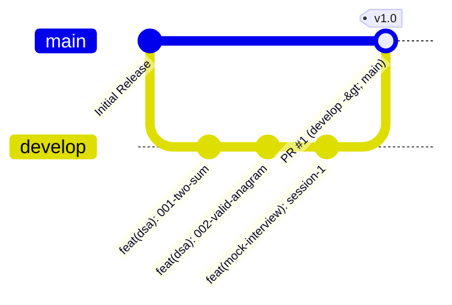

# 🤝 Contributing & Engineering Guidelines

Welcome to the **MAANG Daily Coding & SDET Preparation Hub**.
This document outlines our engineering standards, branching strategy, safety checks, and continuous integration workflows.

---

## 🌳 1. Git Branching Strategy & Invariants

We follow a strict, protected-branch Git flow:



1. **`main` (Protected Release Branch)**:
   - Direct commits and direct pushes to `main` are **strictly forbidden**.
   - Changes enter `main` solely via GitHub Pull Requests merged after passing all CI gates and security reviews.
2. **`develop` (Active Integration Branch)**:
   - All feature work, DSA problem solutions, framework modules, and mock interview sessions are staged and pushed to `develop`.
3. **Feature Branches (`feat/...`)**:
   - For isolated feature development or team collaboration, branch off `develop` and open a PR back to `develop`.

---

## 🛡️ 2. Pre-Push Safety Audit & Git Hooks

To guarantee zero leaked secrets, API keys, or private files:
1. **Automated Pre-Push Hook**:
   Enable the pre-configured git hook:
   ```bash
   git config core.hooksPath .githooks
   ```
   Now, every `git push` automatically invokes `.agents/skills/github/scripts/safety_check.sh`.
2. **Manual Security Scan**:
   ```bash
   ./.agents/skills/github/scripts/safety_check.sh
   ```
3. **Zero Leaked Secrets Policy**:
   - Prohibited: GitHub tokens, AWS/GCP credentials, OpenAI/Anthropic API keys, database connection strings.
   - Prohibited: Personal resumes (`*resume*`), private keys (`*.pem`, `*.key`), and PDFs.
   - Prohibited: Build artifacts (`.class`, `.pyc`, `.jar`, `target/`, `allure-results/`).

---

## 📝 3. Conventional Commit Standard

All commits must adhere to the Conventional Commits specification:

```text
<type>(<scope>): <imperative summary>

[optional body describing Big-O, technique, and verification]

[optional footer: Score, Tracker status]
```

### Allowed Types
- `feat`: A newly solved DSA problem, framework component, or mock interview session.
- `fix`: A bug fix or corrected test assertion.
- `refactor`: Code optimization without altering public behavior or passing status.
- `docs`: Documentation updates, README changes, or concept guides.
- `test`: Test suite additions, assertions, or test runner modifications.
- `chore`: Tooling updates, git configuration, dependencies.

### Scopes
- `dsa/<slug>` (e.g., `feat(dsa/001-two-sum): ...`)
- `frameworks/<module>` (e.g., `feat(frameworks/playwright-java): ...`)
- `mock-interviews/<session>` (e.g., `feat(mock-interviews/interview-1): ...`)
- `github` (e.g., `feat(github): ...`)
- `tools` (e.g., `chore(tools): ...`)

---

## 🧪 4. Testing & Running Solutions

Use the unified test runner:
- Test a specific problem across both Java and Python:
  ```bash
  ./run.sh test 001-two-sum
  ```
- Test Java only:
  ```bash
  ./run.sh test 001-two-sum --lang java
  ```
- Test Python only:
  ```bash
  ./run.sh test 001-two-sum --lang python
  ```
- Test all completed solutions marked in `dsa/MASTER_SHEET.md`:
  ```bash
  ./run.sh test-completed
  ```
- View overall progress dashboard:
  ```bash
  python3 tools/tracker.py summary
  ```

---

## 🤖 5. Antigravity Agent Personas

- **`/interviewer`**: Evaluates your Java & Python solutions against a 100-point MAANG rubric.
- **`/hint`**: Multi-tiered algorithmic coach (mental models, patterns, invariants).
- **`/progress`**: Curriculum advisor recommending next targets.
- **`/github`**: Automated release, safety audit, and PR management.
- **`/mock-interview`**: Simulates end-to-end Senior/Lead SDET interviews with AI utilizations.
