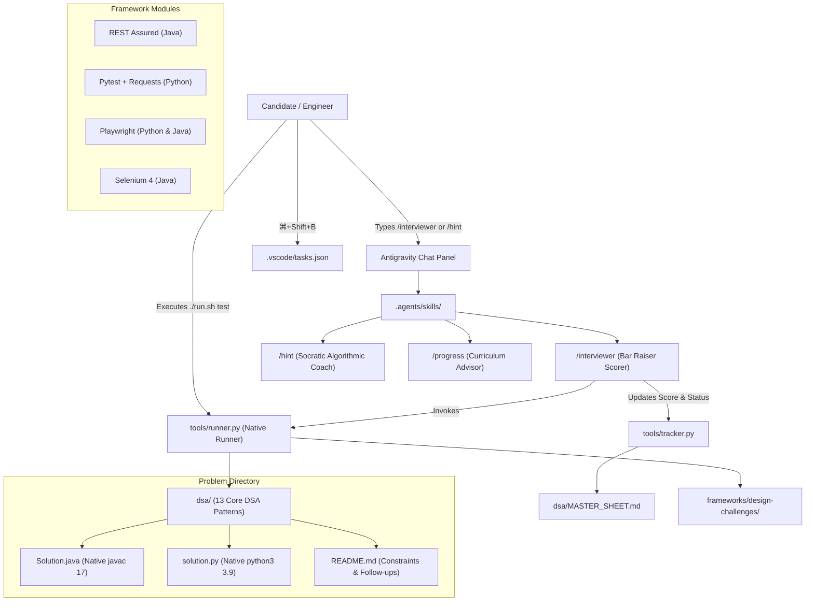

# Monorepo Architecture & Engineering Blueprint

This document details the architectural design, agent orchestration, test compilation pipeline, and directory boundaries of the **MAANG Daily Coding & SDET Preparation Hub**.

---

## 1. System Architecture Overview

The repository is organized as a high-cohesion, low-coupling monorepo uniting **Algorithmic Problem Solving (DSA)** with **Enterprise Automation Frameworks (API & UI)** and **Agentic Interview Simulations**.



---

## 2. Directory Boundaries & Separation of Concerns

```text
codingforinterviews/
├── .agents/
│   └── skills/                      # Antigravity first-class slash commands
│       ├── interviewer/SKILL.md     # /interviewer (Scoring rubric, follow-ups)
│       ├── hint/SKILL.md            # /hint (4-tier Socratic guidance)
│       └── progress/SKILL.md        # /progress (Readiness breakdown)
├── .vscode/
│   ├── tasks.json                   # 1-click execution shortcuts
│   └── settings.json                # Language server source paths
├── docs/                            # Central Documentation Hub
│   ├── ARCHITECTURE.md              # System design & compilation blueprint
│   ├── DSA_CURRICULUM_GUIDE.md      # Pattern identification & complexity guide
│   ├── FRAMEWORKS_GUIDE.md          # Enterprise QA framework architecture
│   └── INTERVIEW_PLAYBOOK.md        # MAANG interview communication & time management
├── GEMINI.md                        # Persistent workspace rules for Antigravity
├── README.md                        # Master hub portal
├── run.sh                           # Root test runner launcher
├── tools/
│   ├── runner.py                    # Multi-language compiler & test harness
│   └── tracker.py                   # Master sheet parser & updater
├── dsa/                             # 13 Algorithmic Patterns
│   ├── MASTER_SHEET.md              # 128 curated problems tracker
│   ├── utils/                       # Shared ListNode & TreeNode helpers
│   ├── 01-arrays-and-hashing/
│   ├── 02-two-pointers/
│   ├── 03-sliding-window/
│   └── ... (all 13 patterns)
└── frameworks/                      # Automation & SDET System Design
    ├── MASTER_FRAMEWORKS.md         # Framework status & roadmap
    ├── api-automation/
    │   ├── restassured-java/        # Enterprise REST Assured suite
    │   └── pytest-requests-python/  # Pytest API suite with Pydantic
    ├── ui-automation/
    │   ├── playwright-python/       # Modern Playwright Page Object Model
    │   ├── playwright-java/         # Playwright Java with ThreadLocal Page
    │   └── selenium-java/           # Selenium 4 with ThreadLocal WebDriver
    └── design-challenges/           # Top-tier MAANG live coding challenges
        ├── 01-custom-retry-analyzer
        ├── 02-json-payload-diff-engine
        ├── 03-rate-limited-test-client
        ├── 04-test-data-builder
        └── 05-microservice-mocking
```

---

## 3. The Dual-Language Execution Engine (`tools/runner.py`)

Every DSA problem and live coding challenge must be solved in **both Java and Python**. The execution engine ensures deterministic, native execution without requiring heavy build systems:

### Java Execution Pipeline
1. **Compilation**: Invokes `javac -d .build/java/<problem> -cp "dsa:dsa/utils:." Solution.java`.
2. **Execution**: Runs `java -ea -cp ".build/java/<problem>:dsa:." Solution`.
   - The `-ea` (Enable Assertions) flag is mandatory: assertions in `main()` validate edge cases and time out if execution exceeds 10 seconds.
3. **Memory & Latency**: Times execution in milliseconds and isolates `.class` files inside `.build/` to keep the workspace clean.

### Python Execution Pipeline
1. **Environment**: Automatically injects `dsa/` and `dsa/utils/` into `PYTHONPATH`.
2. **Execution**: Runs `python3 solution.py` in an isolated subprocess with a 10-second timeout.
3. **Verification**: Checks assertions in the `if __name__ == '__main__':` block.

---

## 4. Antigravity Agent Orchestration

Antigravity natively mounts skills placed under `.agents/skills/<name>/SKILL.md` as chat slash commands:

### The Interviewer Agent (`/interviewer`)
- **Evaluates**:
  - Code correctness (null, empty, bounds, large values).
  - Time & Space complexity Big-$O$ analysis.
  - Idiomatic Java (Streams, standard collections, clean OOP) vs Idiomatic Python (comprehensions, generators, slicing).
  - Test case thoroughness.
- **Passing Gate ($\ge 80/100$)**:
  - Automatically updates `dsa/MASTER_SHEET.md` using `tools/tracker.py`.
  - Poses 1-2 realistic MAANG interview follow-up questions.

### The Socratic Hint Agent (`/hint`)
- **4-Tier Progressive Hints**:
  - **Tier 1 (Mental Model)**: High-level intuition and analogy.
  - **Tier 2 (Pattern Identification)**: Explains which pattern applies and why.
  - **Tier 3 (Algorithmic Blueprint)**: Invariants, pointer movements, and loop bounds.
  - **Tier 4 (Scaffolding)**: Code skeleton with `# TODO` tags.

---

## 5. Automated Progress Tracker (`tools/tracker.py`)

The tracker parses the Markdown table in `dsa/MASTER_SHEET.md` and generates real-time completion analytics:
- Dual-stack implementation percentage.
- Breakdown by Difficulty (Easy / Medium / Hard).
- Breakdown by Algorithmic Pattern.
- Status update engine invoked automatically by `/interviewer`.
