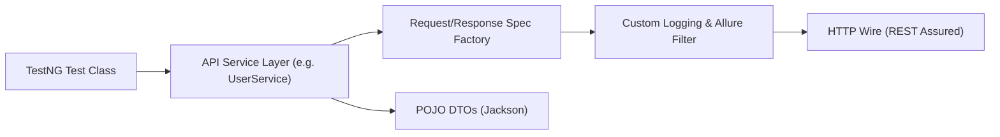

# Enterprise Automation Frameworks & SDET System Design Guide

This manual covers the architectural principles, design patterns, and engineering practices implemented in the `frameworks/` module, tailored for Senior SDET / QA Architect / Staff QE interviews.

---

## 🏗️ 1. API Automation Framework Architecture

### A. Java + REST Assured (Enterprise Architecture)
Located in [`frameworks/api-automation/restassured-java/`](../frameworks/api-automation/restassured-java/):



#### Core Design Patterns:
1. **Specification Factory Pattern**:
   - Centralizes base URI, standard headers (`Content-Type: application/json`), and authentication tokens (`Bearer`).
   - Prevents duplicate configuration across hundreds of test cases.
2. **POJO / DTO Modeling (Jackson)**:
   - Uses typed Java classes instead of hardcoded JSON strings.
   - Enforces contract consistency and compile-time verification of payload changes.
3. **Filter Pipeline**:
   - `io.restassured.filter.Filter` implementation intercepts requests and responses to automatically log cURL commands and capture timing metrics into Allure reports.

---

### B. Python + Pytest + Requests + Pydantic
Located in [`frameworks/api-automation/pytest-requests-python/`](../frameworks/api-automation/pytest-requests-python/):

#### Core Design Patterns:
1. **Session Pooling**:
   - Uses a persistent `requests.Session()` across tests to enable HTTP Connection Keep-Alive, significantly reducing TLS handshake overhead.
2. **Contract Schema Validation (Pydantic)**:
   - Evaluates API responses against strict Pydantic models:
     ```python
     class UserResponse(BaseModel):
         id: int
         name: str
         email: EmailStr
         active: bool
     ```
   - Automatically catches missing fields, unexpected `null` values, and type discrepancies.
3. **Pytest Fixtures**:
   - Scoped fixtures (`scope="session"`, `scope="function"`) supply authenticated clients, clean up test data via teardown generators, and support parallel test execution via `pytest-xdist`.

---

## 🖥️ 2. UI Automation Framework Architecture

### A. Playwright (Python & Java)
Located in [`frameworks/ui-automation/playwright-python/`](../frameworks/ui-automation/playwright-python/) and [`frameworks/ui-automation/playwright-java/`](../frameworks/ui-automation/playwright-java/):

#### Architectural Advantages:
1. **Intelligent Auto-Waiting**:
   - Eliminates fragile `Thread.sleep()` or brittle custom pollers. Playwright automatically checks actionability (visible, stable, enabled, clickable) before executing actions.
2. **Browser Context Isolation**:
   - Each test runs inside an isolated `BrowserContext` (comparable to an incognito profile). Sessions, cookies, and local storage never leak between tests.
3. **Resilient Dual Selectors**:
   - Uses accessibility-first locators (`getByRole`, `data-testid`) paired with CSS fallbacks to protect tests against UI redesigns.

---

### B. Selenium 4 (Java + TestNG)
Located in [`frameworks/ui-automation/selenium-java/`](../frameworks/ui-automation/selenium-java/):

#### Thread-Safe Parallel Driver Management:
```java
public class WebDriverFactory {
    private static final ThreadLocal<WebDriver> driverThread = new ThreadLocal<>();

    public static WebDriver getDriver() {
        return driverThread.get();
    }

    public static void setDriver(WebDriver driver) {
        driverThread.set(driver);
    }

    public static void quitDriver() {
        if (driverThread.get() != null) {
            driverThread.get().quit();
            driverThread.remove(); // Prevents memory leaks in thread pools
        }
    }
}
```

---

## 🎯 3. MAANG SDET Live Coding Challenges

MAANG SDET rounds frequently feature 45-minute live coding challenges testing your ability to build framework utilities from scratch:

| Challenge | Real-World SDET Problem | Engineering Core |
| :--- | :--- | :--- |
| **CH-01: Custom Retry Analyzer** | Network blips cause flaky tests | Exponential backoff delay with jitter; distinguishing retriable vs non-retriable exceptions. |
| **CH-02: JSON Diff Engine** | Comparing massive dynamic API payloads | Recursive tree comparison, unordered array matching, and ignored dynamic path sets (`timestamp`, `traceId`). |
| **CH-03: Rate-Limited Test Client** | API rate limits (e.g. 100 req/sec) crash test suites | Token Bucket algorithm with thread synchronization. |
| **CH-04: Test Data Builder** | Complex microservice nested test data | Fluent builder pattern with dynamic overriding and deep cloning. |
| **CH-05: Microservice Mock Engine** | Testing downstream service outages & latencies | Dynamic stubbing, fault injection, and latency simulation. |
