# MAANG Interview Playbook: 45-Minute Execution Protocol

This guide outlines the communication framework, time management timeline, and mental checklist required to clear Bar Raiser and technical coding rounds at Google, Meta, Amazon, Apple, and Netflix.

---

## ⏱️ The 45-Minute Interview Timeline

```mermaid
gantt
    title 45-Minute Coding Interview Timeline
    dateFormat mm
    axisFormat %M min

    section Problem Discovery
    Clarify Requirements & Constraints :00, 05m

    section Algorithmic Strategy
    Discuss Brute Force vs Optimal Big-O :05, 10m
    Get Interviewer Alignment & Buy-In  :12, 03m

    section Implementation
    Write Clean Idiomatic Code          :15, 17m

    section Verification
    Dry-Run Trace with Edge Cases       :32, 06m
    Address Performance & Follow-ups    :38, 07m
```

---

## 🗣️ Phase-by-Phase Breakdown

### Phase 1: Clarification & Boundaries (0:00 – 5:00)
**Never start coding immediately.** Treat the interviewer as a collaborator.
1. **Clarify Inputs & Data Types**:
   - "Can the input array be empty or `null`?"
   - "Can numbers be negative, zero, or floating point?"
   - "Is the array guaranteed to be sorted? Are values unique?"
2. **Clarify Scale & Bounds**:
   - "What is the maximum value of $N$? ($10^3, 10^5, 10^9$?)"
     - If $N \le 10^3 \to O(N^2)$ might be acceptable.
     - If $N \le 10^5 \to O(N \log N)$ or $O(N)$ is required.
     - If $N \ge 10^9 \to O(\log N)$ or $O(1)$ is required.
3. **Formulate Edge Cases**:
   - Write down 2 edge cases on the whiteboard/editor before writing a single line of code (e.g. single element, all duplicates, no valid pair).

---

### Phase 2: Strategy, Trade-offs & Alignment (5:00 – 15:00)
1. **State the Naive Brute Force**:
   - "The naive approach is to use two nested loops checking all pairs, which takes $O(N^2)$ time and $O(1)$ space."
2. **Propose the Optimal Approach**:
   - "We can optimize this to $O(N)$ time by using a Hash Map to store elements we've seen so far, trading $O(N)$ space for $O(1)$ lookup time."
3. **Walk through the Invariant**:
   - Step through Example 1 using your proposed data structure.
4. **Obtain Interviewer Buy-In**:
   - Ask: *"Does this approach sound reasonable to you, or would you like me to consider another direction before I start coding?"*

---

### Phase 3: Implementation & Clean Code (15:00 – 32:00)
1. **Meaningful Variable Names**:
   - Avoid `x`, `y`, `temp`. Use `left`, `right`, `complement`, `maxProfit`, `prefixSum`.
2. **Modularity**:
   - Break complex logic into clear helper methods if appropriate.
3. **Language Idioms**:
   - **Java**: Use appropriate types (`Map<Integer, Integer>`, not raw types), avoid unnecessary boxing/unboxing, handle null checks first.
   - **Python**: Use `enumerate`, generator expressions, tuple unpacking, and dictionary `.get()` where appropriate.
4. **Communicate While Coding**:
   - Don't go silent for more than 45 seconds. Explain: "Now I'm setting up our two pointers at the boundaries..."

---

### Phase 4: Dry-Run & Edge-Case Testing (32:00 – 38:00)
1. **Step Through with a Concrete Example**:
   - Manually trace variable values step-by-step through your written code.
2. **Audit Edge Cases**:
   - Check array bounds (`i < nums.length`).
   - Check empty input handling.
   - In Java, check potential integer overflow: `mid = left + (right - left) / 2`.

---

### Phase 5: Scale, Follow-ups & System Extension (38:00 – 45:00)
1. **Complexity Summary**:
   - Clearly restate: "Time complexity is $O(N)$ because we make a single pass through the array. Space complexity is $O(N)$ in the worst case where all elements are unique."
2. **Be Prepared for Common MAANG Follow-ups**:
   - *Memory Constrained*: "What if the input is 500GB and doesn't fit into memory?" $\to$ External merge sort, chunked processing, or Bloom filter.
   - *Streaming Input*: "What if numbers arrive indefinitely from a Kafka stream?" $\to$ Sliding window with fixed buffer, reservoir sampling, or min-heap.
   - *Concurrency*: "How would multiple worker threads process this safely?" $\to$ Partitioning by key range, ConcurrentHashMap, or ReadWriteLock.

---

## 🔍 The SDET Advantage: How to Stand Out
As an SDET candidate, interviewers expect **deep quality and edge-case instincts**:
- Before writing the solution, proactively ask: *"Would you like me to write unit assertions covering edge cases as part of my implementation?"*
- Mention boundary condition testing: off-by-one indices, unicode vs ASCII characters, null pointer defenses.
- Relate algorithmic trade-offs to system stability: "In a production microservice, while $O(N)$ memory is theoretically fine, if $N$ is unpredictable, an $O(1)$ two-pointer approach might protect against OutOfMemory errors."
