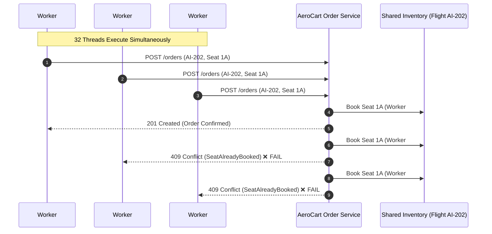

# 🛠️ Architecture Kata 01: Distributed Concurrency & Tenant Isolation Under 32 Parallel Workers

**Role Level:** Senior / Lead SDET Architect  
**Domain:** Distributed System Design for QE & High-Throughput Microservice Concurrency  
**Application Under Test (AUT):** AeroCart Airline Platform (`apps/aerocart/server.py`)  

---

## 🚨 1. The Incident Briefing & Failure Scenario

You are leading quality engineering for an airline booking platform. To accelerate the CI/CD pipeline, the team scaled test execution from 1 worker to **32 parallel CI threads**.

Immediately, the nightly regression run went from green to red:
- **Failure Symptom:** Tests booking Flight `AI-202` (Seat `1A`) intermittently fail with `HTTP 409 Conflict: SeatAlreadyBooked`.
- **Root Cause:** All 32 parallel workers are executing against a shared staging database. When Worker #1 books Seat `1A`, Workers #2 through #32 fail because their tests try to book the same finite seat at the same millisecond!
- **Anti-Pattern Attempted:** A developer suggests running `TRUNCATE TABLE inventory;` before every test. In a parallel run, truncating the database causes in-flight tests on other workers to crash instantly.



---

## 🏃 2. Step 1: Observe the Failure (Naive Baseline)

Run the naive execution baseline where 32 parallel threads attempt to book Seat `1A` without tenant isolation:

```bash
python3 frameworks/sdet-system-design/01-distributed-concurrency-isolation/naive_baseline.py
```

### Expected Output:
```text
🚨 Executing Naive 32-Thread Parallel Run (NO Tenant Isolation)...
   Worker #1 -> HTTP 201 Created (ORD-84A2)
   Worker #2 -> HTTP 409 Conflict: Seat 1A already occupied!
   ...
   Worker #32 -> HTTP 409 Conflict: Seat 1A already occupied!

❌ RESULT: 31 / 32 Threads FAILED (96.8% failure rate)!
```

---

## 🎯 3. Step 2: The Architectural Challenge

Your task is to implement **Dynamic Tenant Key Partitioning** in `solution.py` (Python) or `Solution.java` (Java):

### Acceptance Criteria:
1. **Thread-Safe Tenant Isolation:** Every parallel worker thread must dynamically generate its own unique execution tenant context (`tenant_<uuid>`).
2. **Context Propagation:** The tenant key must be injected into the outbound HTTP request header:
   ```http
   X-Test-Tenant-ID: tenant_<uuid>
   ```
3. **Zero Collisions:** Execute **32 parallel threads simultaneously**, each booking Seat `1A` on Flight `AI-202`.
4. **100% Pass Rate:** All 32 parallel threads must succeed (`HTTP 201 Created`) with zero collisions, zero state leaks, and execution completing in **< 500ms**!

---

## 💻 4. Step 3: Implement Your Solution

Open **`solution.py`** (or `Solution.java`) and complete the implementation in the designated `TODO` sections:

```python
# File: frameworks/sdet-system-design/01-distributed-concurrency-isolation/solution.py

def run_isolated_worker(worker_id: int) -> dict:
    # TODO: Candidate implements dynamic tenant generation & context injection
    pass
```

---

## ✅ 5. Step 4: Verify Your Solution

Run the automated verification harness:

```bash
python3 frameworks/sdet-system-design/01-distributed-concurrency-isolation/solution.py
```

When all 32 threads pass, invoke `/interviewer` to evaluate your architecture against the Staff-level rubric!
