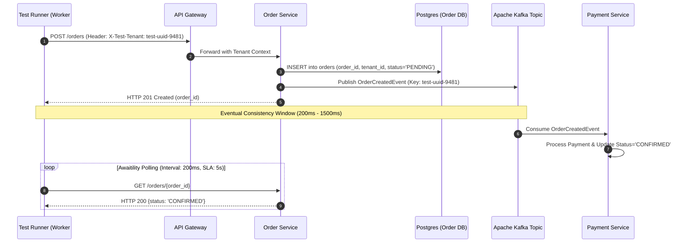
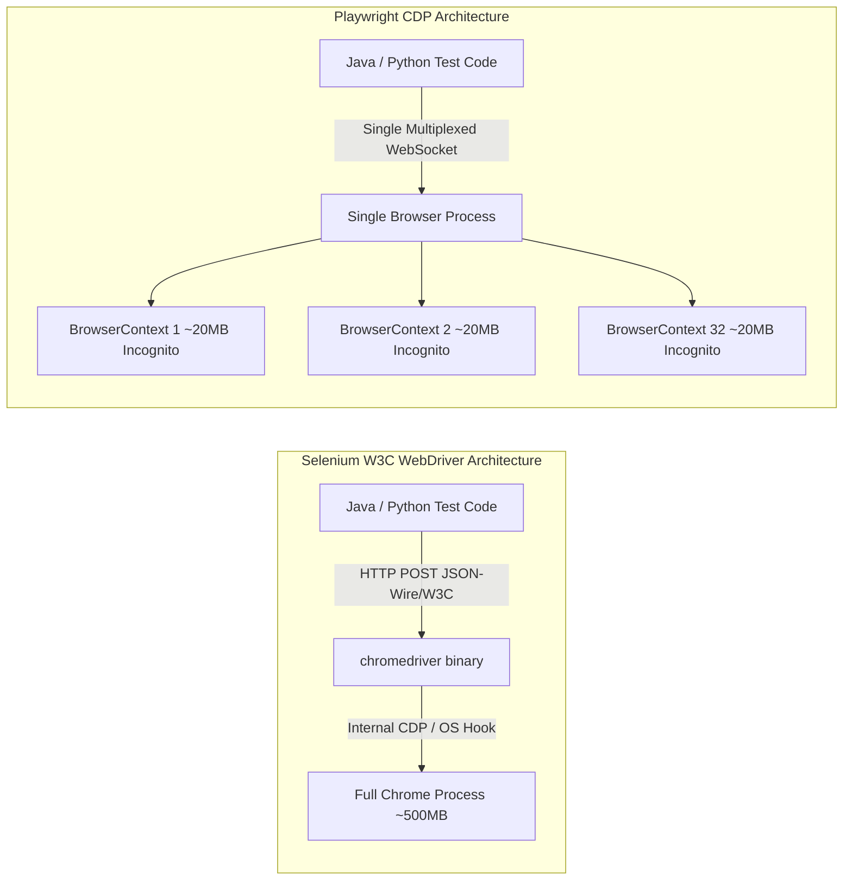
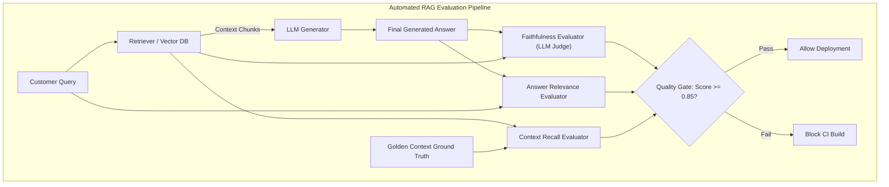
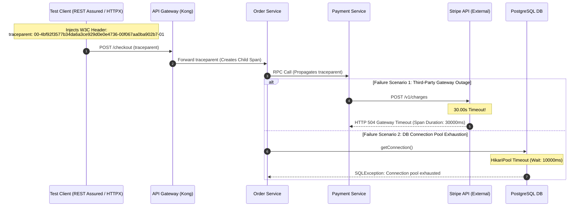
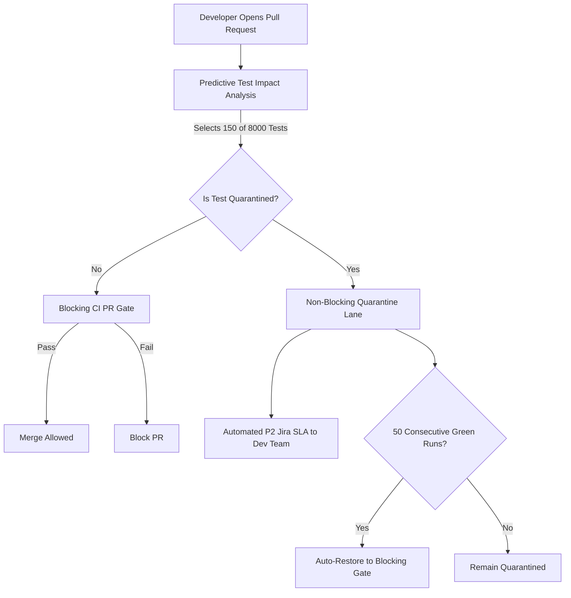

# 🧠 Deep Conceptual Mastery Guide: Session #1
**Target Role:** Senior / Lead SDET (AI-Enhanced Quality Engineering)  
**Level:** Staff / Principal QE Blueprint & Architectural Mastery  
**Scope:** Distributed Systems QE, Playwright/Selenium Internals, RAG & Agentic QE, OpenTelemetry Observability, DORA Governance  

---

## 📚 Table of Contents
1. [Topic 1: Distributed Test Data Isolation & Eventual Consistency in Microservices (Kafka & CDC)](#1-distributed-test-data-isolation--eventual-consistency)
2. [Topic 2: Automation Protocol Deep Dive — Playwright (CDP WebSocket) vs Selenium (W3C HTTP) & Concurrency](#2-automation-protocol-deep-dive--playwright-vs-selenium)
3. [Topic 3: AI & Agentic QE — RAG Evaluation Pipeline & Autonomous Self-Healing Agents](#3-ai--agentic-qe--rag-evaluation--self-healing)
4. [Topic 4: Observability, Distributed Tracing & Automated RCA in Quality Engineering](#4-observability-distributed-tracing--automated-rca)
5. [Topic 5: Technical Leadership, Flaky Test Quarantine & DORA Metrics Optimization](#5-technical-leadership-flaky-test-quarantine--dora-metrics)

---

## 1. Distributed Test Data Isolation & Eventual Consistency

### 💡 The Intuitive Mental Model
Imagine a busy restaurant kitchen with 50 cooks (50 parallel CI workers) sharing a single blackboard to write customer orders. If Cook #1 writes *"Order #101: Table 4 wants Steak"*, and Cook #2 simultaneously erases the board or changes Table 4's order to *"Fish"*, chaos ensues. The kitchen burns down not because the cooks can't cook, but because they are mutating a **shared mutable chalkboard**.

Now imagine each cook gives the diner a unique numbered ticket with a random barcode (`UUID`). Even if 50 cooks prepare orders at the exact same moment, their tickets never overlap. When the kitchen sends the ticket to the billing station via conveyor belt (Kafka), the cashier doesn't immediately hand over the receipt—the waiter watches the ticket bin for that specific barcode (asynchronous polling with SLA) and serves the meal the instant it appears.

---

### ⚙️ Internal Engine Mechanics



#### 1. Why Static Shared Data & DB Resets Fail at Scale
- **Database Resets (`TRUNCATE` / DB rollbacks):** In a 30-microservice architecture, resetting databases between tests takes 5-30 seconds per test. Across 50 workers, this causes database connection pool exhaustion, table lock contention, and makes parallel execution completely impossible.
- **Dynamic Business Key Partitioning:** Every test generates an ephemeral **Test Tenant Key** (`UUID.randomUUID()`). All downstream entities (e.g. emails `user_<uuid>@test.com`, booking codes `BK_<uuid>`, credit card reference `TOK_<uuid>`) are namespaced by this key. Two parallel tests booking the same flight seat never collide because each test seeds its own ephemeral flight inventory record.

#### 2. Eventual Consistency & Polling Mechanics vs Kafka Test Harnesses
- **The Polling Pattern (Read-Model Verification):** When Service A publishes an event to Kafka, Service B updates its read-model asynchronously. Tests must NEVER use hardcoded `Thread.sleep()`. We use an **Exponential Backoff Polling Pattern** (e.g., Awaitility in Java, `tenacity` in Python) that polls the target read-endpoint with a tight interval (e.g. 100ms) up to a bounded SLA (e.g. 5 seconds).
- **Direct Kafka Consumer Assertion (Write-Model Verification):** For asynchronous event-driven pipelines, the test harness can attach directly as an ephemeral Kafka Consumer to the destination topic (e.g., `orders.v1.events`), filtering incoming Kafka record headers for `X-Correlation-ID == <test-uuid>`. The test resolves the exact millisecond the event is committed to the topic, avoiding wasteful HTTP polling entirely.

#### 3. Transactional Outbox Pattern & CDC Verification
In high-scale microservices, services write events to an `outbox` table within the same database transaction as the business entity. A Change Data Capture (CDC) engine (e.g., **Debezium**) tails the PostgreSQL write-ahead log (WAL) and streams changes to Kafka. Quality engineers verify outbox consistency by asserting that both the database record and the corresponding WAL CDC event were emitted with matching transaction IDs.

---

### 💻 Production Implementation Blueprint (Java & Python)

#### Java 17: Production Async Assertion with Awaitility & Dynamic Tenant Key
```java
package com.maang.framework.core.data;

import io.restassured.RestAssured;
import io.restassured.response.Response;
import org.awaitility.Awaitility;

import java.time.Duration;
import java.util.UUID;

public class OrderVerificationEngine {

    public record TestContext(String tenantId, String orderId, String customerEmail) {}

    public static TestContext createEphemeralOrder() {
        String uuid = UUID.randomUUID().toString().substring(0, 8);
        String tenantId = "tenant_" + uuid;
        String email = "qa_user_" + uuid + "@testvault.io";

        // 1. Create order with dynamic tenant isolation
        Response response = RestAssured.given()
                .header("X-Test-Tenant-ID", tenantId)
                .contentType("application/json")
                .body(String.format("{\"customerEmail\": \"%s\", \"amount\": 250.00}", email))
                .when()
                .post("/api/v1/orders")
                .then()
                .statusCode(201)
                .extract().response();

        String orderId = response.jsonPath().getString("orderId");
        return new TestContext(tenantId, orderId, email);
    }

    public static void assertOrderReachesState(String orderId, String expectedStatus, Duration timeout) {
        // 2. Deterministic Asynchronous Polling with Awaitility (Zero Thread.sleep)
        Awaitility.await()
                .atMost(timeout)
                .pollInterval(Duration.ofMillis(200))
                .pollDelay(Duration.ofMillis(100))
                .untilAsserted(() -> {
                    Response res = RestAssured.given()
                            .when()
                            .get("/api/v1/orders/" + orderId)
                            .then()
                            .extract().response();

                    String currentStatus = res.jsonPath().getString("status");
                    org.junit.jupiter.api.Assertions.assertEquals(
                            expectedStatus, 
                            currentStatus,
                            "Order did not reach expected state within SLA!"
                    );
                });
    }
}
```

#### Python 3.11: Production Polling Fixture with `tenacity` & Dynamic Isolation
```python
import uuid
import httpx
import pytest
from tenacity import retry, stop_after_delay, wait_exponential, retry_if_result

BASE_URL = "https://staging.internal.platform/api/v1"

class TestTenantContext:
    def __init__(self):
        self.run_id = uuid.uuid4().hex[:8]
        self.tenant_id = f"tenant_{self.run_id}"
        self.email = f"lead_sdet_{self.run_id}@testplatform.org"

@pytest.fixture
def test_context():
    """Generates an ephemeral, isolated tenant context per test."""
    return TestTenantContext()

def _status_not_ready(response: httpx.Response) -> bool:
    if response.status_code != 200:
        return True
    return response.json().get("status") != "CONFIRMED"

@retry(
    stop=stop_after_delay(5.0),
    wait=wait_exponential(multiplier=0.1, min=0.1, max=0.8),
    retry=retry_if_result(_status_not_ready)
)
def wait_for_order_confirmation(client: httpx.Client, order_id: str) -> httpx.Response:
    """Non-blocking, bounded exponential backoff assertion."""
    return client.get(f"{BASE_URL}/orders/{order_id}")

def test_distributed_booking_saga(test_context):
    with httpx.Client(headers={"X-Test-Tenant-ID": test_context.tenant_id}) as client:
        # Step 1: Create Order
        create_res = client.post(f"{BASE_URL}/orders", json={
            "customerEmail": test_context.email,
            "flightNumber": "AI-202",
            "seat": "14B"
        })
        assert create_res.status_code == 201
        order_id = create_res.json()["orderId"]

        # Step 2: Asynchronously verify Kafka event processing & CDC state transition
        verified_res = wait_for_order_confirmation(client, order_id)
        assert verified_res.json()["status"] == "CONFIRMED"
```

---

### ⚠️ MAANG Interview Gotchas & Traps
- **Trap 1:** Candidate says *"We truncate tables in `@BeforeMethod`"*.  
  *Interviewer Counter:* *"You have 50 workers running in parallel against staging. If Worker #1 truncates the table, Worker #2's in-flight test instantly crashes. How do you solve this?"*  
  *Winning Answer:* *"Never truncate shared staging databases. We use dynamic tenant partitioning where every test uses unique cryptographic keys and dedicated ephemeral partition IDs."*
- **Trap 2:** Candidate says *"We increase `Thread.sleep(10000)` to handle Kafka delays"*.  
  *Interviewer Counter:* *"If 1,000 tests sleep 10 seconds, that's 2.7 machine hours of pure idle CPU waste. How do you make this sub-second?"*  
  *Winning Answer:* *"We replace sleep with Awaitility/tenacity polling loops that resolve in the exact 100ms window the event arrives, or consume the Kafka topic directly by correlating `X-Correlation-ID` headers."*

---

## 2. Automation Protocol Deep Dive — Playwright vs Selenium

### 💡 The Intuitive Mental Model
- **Selenium WebDriver is like the 19th-Century Postal System:**  
  You want the browser to click a button. You write a letter (`POST /session/123/element`), put it in an envelope, send it over the postal road (HTTP network request) to a postmaster (`chromedriver`). The postmaster translates the letter, gives it to the browser, writes a reply letter (`HTTP 200 OK {elementId: 'abc'}`), and mails it back. To click it, you mail a second letter (`POST /session/123/element/abc/click`). If your page has 50 dynamic interactions, that is 100 separate postal delivery roundtrips!
- **Playwright is a Dedicated Fiber-Optic Phone Call (WebSocket):**  
  Playwright dials the browser process directly over a full-duplex WebSocket connection. The line stays open continuously. Playwright doesn't "send letters"; it speaks binary frames back and forth in microseconds. Furthermore, Playwright doesn't ask *"Is the button visible yet?"* every 500ms—the browser *tells* Playwright the exact millisecond the DOM node attaches, animates, and stabilizes!

---

### ⚙️ Internal Engine Mechanics



#### 1. Communication Protocols: W3C HTTP REST vs Chrome DevTools Protocol (CDP) WebSocket
- **Selenium:** Every WebDriver call is a discrete HTTP 1.1 request over a local socket. Even on `localhost`, HTTP headers, TCP handshakes, serialization, and deserialization create a latency baseline of 5-30ms per interaction.
- **Playwright:** Uses a persistent bidirectional WebSocket connection speaking JSON-RPC. It multiplexes events, network interception, console logs, and DOM commands over a single channel. Latency drops to **<1 millisecond** per command.

#### 2. Process Overhead: Full OS Browser Process vs `BrowserContext`
- In Selenium, achieving test isolation requires launching a brand-new `WebDriver` instance per thread. 32 threads = 32 full OS browser processes = **16GB to 25GB RAM**.
- In Playwright, you launch **one single `Browser` instance** per container. For each parallel test, you call `browser.newContext()`. A `BrowserContext` is a completely isolated incognito profile inside the browser's V8 engine with independent cookies, cache, local storage, and service workers. A context launches in **<15ms** and consumes **<25MB of RAM**. 32 contexts consume only ~800MB RAM total!

#### 3. Actionability Auto-Waiting Mechanics
Before interacting with an element (`page.click("button")`), Playwright automatically executes 5 internal checks:
1. **Attached:** Element is present in the DOM tree.
2. **Visible:** Element does not have `display: none`, `visibility: hidden`, or zero bounding box.
3. **Stable:** Element is not undergoing CSS animations or layout shifts.
4. **Enabled:** Element does not have the `disabled` attribute.
5. **Receives Events:** Element is not covered by modal overlays, sticky headers, or backdrop scrims.

#### 4. The Modern Hydration Race Condition Failure Mode
In Server-Side Rendered (SSR) applications (Next.js, Nuxt, React 18):
- The server sends pure HTML. The button is visible, attached, and enabled.
- Playwright's actionability checks pass, and it clicks the button!
- **The Bug:** The client-side JavaScript bundle has not finished downloading and "hydrating" (attaching `onClick` listeners). The click lands on dead HTML; nothing happens, and the test fails!
- **The Staff SDET Solution:** Assert readiness through user-observable reactive states (e.g. wait for network hydration indicator, or `page.waitForResponse(...)`).

---

### 💻 Production Implementation Blueprint (Java & Python)

#### Java 17: Thread-Safe High-Throughput Playwright Factory
```java
package com.maang.framework.core.driver;

import com.microsoft.playwright.*;

public class PlaywrightManager {

    // 1 single OS browser process shared across all threads
    private static Playwright playwright;
    private static Browser browser;

    // Lightweight BrowserContext and Page isolated per parallel thread
    private static final ThreadLocal<BrowserContext> contextThreadLocal = new ThreadLocal<>();
    private static final ThreadLocal<Page> pageThreadLocal = new ThreadLocal<>();

    public static synchronized void initializeBrowser() {
        if (playwright == null) {
            playwright = Playwright.create();
            browser = playwright.chromium().launch(new BrowserType.LaunchOptions()
                    .setHeadless(true)
                    .setArgs(java.util.List.of("--no-sandbox", "--disable-dev-shm-usage")));
        }
    }

    public static void createTestContext() {
        // Ultra-lightweight incognito context: ~15ms startup, ~20MB RAM
        BrowserContext context = browser.newContext(new Browser.NewContextOptions()
                .setViewportSize(1920, 1080)
                .setJavaScriptEnabled(true));
        
        Page page = context.newPage();
        contextThreadLocal.set(context);
        pageThreadLocal.set(page);
    }

    public static Page getPage() {
        return pageThreadLocal.get();
    }

    public static void closeTestContext() {
        if (contextThreadLocal.get() != null) {
            contextThreadLocal.get().close(); // Flushes cookies, storage, pages
            contextThreadLocal.remove();
            pageThreadLocal.remove();
        }
    }

    public static synchronized void teardownBrowser() {
        if (browser != null) {
            browser.close();
            playwright.close();
        }
    }
}
```

#### Python 3.11: Pytest Playwright Concurrency Architecture (`conftest.py`)
```python
import pytest
from playwright.sync_api import sync_playwright, Browser, BrowserContext, Page

@pytest.fixture(scope="session")
def browser_instance():
    """Single OS-level browser process shared across the test worker."""
    with sync_playwright() as p:
        browser = p.chromium.launch(
            headless=True,
            args=["--no-sandbox", "--disable-dev-shm-usage"]
        )
        yield browser
        browser.close()

@pytest.fixture(scope="function")
def context(browser_instance: Browser) -> BrowserContext:
    """Isolated, ephemeral incognito context per test function."""
    ctx = browser_instance.new_context(
        viewport={"width": 1920, "height": 1080},
        record_video_dir=None
    )
    yield ctx
    ctx.close()

@pytest.fixture(scope="function")
def page(context: BrowserContext) -> Page:
    """Single page instance within the isolated context."""
    page = context.new_page()
    yield page
    page.close()
```

---

### ⚠️ MAANG Interview Gotchas & Traps
- **Trap:** *"How do you handle parallel testing in Playwright?"*  
  *Amateur Answer:* *"I create a new `Playwright.create()` and `browser.launch()` inside `@BeforeMethod` for every test."*  
  *Fatal Result:* Spawns 1,000 OS browser processes, crashing runner with Out-Of-Memory (OOM).  
  *Staff Answer:* *"I launch ONE `Browser` per worker process at the session level, and spawn isolated `BrowserContext` instances per test method. This cuts RAM usage by 95% and startup latency by 99%."*

---

## 3. AI & Agentic QE — RAG Evaluation & Self-Healing

### 💡 The Intuitive Mental Model
- **Testing a Standard Calculator vs Testing an LLM / RAG System:**  
  A calculator is deterministic: `2 + 2` is always `4`. An LLM is a probabilistic word predictor: asking *"Can I get a flight refund?"* might yield 50 grammatically unique answers. You cannot assert `assertEquals(expectedString, actualString)`.
- **The Ragas Open-Book Exam Analogy:**  
  Imagine an open-book exam:
  1. **Context Recall (Retrieval):** Did the student flip to all the right chapters in the textbook?
  2. **Faithfulness (Anti-Hallucination):** Did the student invent answers from their imagination, or did every fact come directly from the opened textbook page?
  3. **Answer Relevance:** Did the student actually answer the question asked, or did they write a 3-page essay about the history of airplanes?

---

### ⚙️ Internal Engine Mechanics



#### 1. The Ragas Evaluation Mathematical Formulations
1. **Faithfulness (Anti-Hallucination):**
   - Deconstruct generated answer $A$ into discrete atomic claims $C = \{c_1, c_2, \dots, c_n\}$.
   - For each claim $c_i$, evaluate whether $c_i$ is strictly entailed by the retrieved context chunks $K$:
     $$\text{Faithfulness} = \frac{|\{c_i \in C \mid K \models c_i\}|}{|C|}$$
2. **Answer Relevance:**
   - Prompt an evaluation LLM to generate $m$ synthetic questions $\{q_1, q_2, \dots, q_m\}$ from the generated answer $A$.
   - Compute the mean cosine similarity between the embeddings of the synthetic questions and the original user query $q_{orig}$:
     $$\text{Answer Relevance} = \frac{1}{m} \sum_{i=1}^{m} \frac{\vec{e}(q_i) \cdot \vec{e}(q_{orig})}{\|\vec{e}(q_i)\| \|\vec{e}(q_{orig})\|}$$

#### 2. Agentic Self-Healing Locator Mechanics
When a locator fails (`ElementNotFoundException`):
1. **Perception:** The agent captures the current DOM subtree, computes the **Accessibility Tree (AOM)**, and extracts bounding coordinates.
2. **Semantic Embedding Match:** It computes cosine similarity between the historical element metadata (`tag: button`, `text: Confirm Booking`, `aria-label: Submit`, `parent: form`) and all candidate nodes in the current DOM.
3. **Execution Sandbox:** The agent dry-runs the interaction in an isolated context and verifies state mutation (e.g., did an order ID appear or URL change?).
4. **AST Code Patching:** Using an **Abstract Syntax Tree (AST)** parser (e.g. `ast` in Python, `JavaParser` in Java), it locates the exact file and line number and generates a clean pull request with before/after visual diffs.

---

### 💻 Production Implementation Blueprint (Java & Python)

#### Python 3.11: Automated RAG Quality Evaluation Gate with Ragas
```python
import os
import pytest
from datasets import Dataset
from ragas import evaluate
from ragas.metrics import faithfulness, answer_relevancy, context_recall

@pytest.fixture
def rag_golden_dataset():
    """Curated golden dataset for airline cancellation policy assistant."""
    data = {
        "question": [
            "Can I cancel my non-refundable ticket within 24 hours of booking?",
            "What is the baggage fee for a second checked bag on transatlantic flights?"
        ],
        "contexts": [
            ["US DOT policy states all tickets can be canceled within 24 hours of booking for a 100% full refund if booked 7+ days prior to departure."],
            ["Transatlantic economy passengers receive 1 complimentary checked bag. A second checked bag incurs an $85 USD fee."]
        ],
        "answer": [
            "Yes, under the 24-hour rule, non-refundable tickets can be canceled for a full refund within 24 hours of booking.",
            "The second checked bag fee for transatlantic flights is $85 USD."
        ],
        "ground_truth": [
            "Yes, customers can cancel non-refundable tickets within 24 hours of purchase for a complete refund without fee.",
            "The second checked bag fee is $85 USD on transatlantic flights."
        ]
    }
    return Dataset.from_dict(data)

def test_rag_pipeline_quality_gate(rag_golden_dataset):
    """Automated CI Quality Gate enforcing mathematical thresholds for RAG."""
    # Execute mathematical evaluation against LLM Judge
    results = evaluate(
        dataset=rag_golden_dataset,
        metrics=[faithfulness, answer_relevancy, context_recall]
    )

    score_dict = results.to_dict()
    print(f"\n📊 RAG Quality Scorecard: {score_dict}")

    # Strict Quality Gates
    assert score_dict["faithfulness"] >= 0.90, f"Faithfulness dropped below SLA: {score_dict['faithfulness']}"
    assert score_dict["answer_relevancy"] >= 0.85, f"Relevance dropped below SLA: {score_dict['answer_relevancy']}"
    assert score_dict["context_recall"] >= 0.85, f"Recall dropped below SLA: {score_dict['context_recall']}"
```

#### Python 3.11: AST-Based Self-Healing Code Patcher
```python
import ast

class LocatorPatcher(ast.NodeTransformer):
    def __init__(self, old_locator: str, new_locator: str):
        self.old_locator = old_locator
        self.new_locator = new_locator
        self.modified = False

    def visit_Constant(self, node):
        if isinstance(node.value, str) and node.value == self.old_locator:
            self.modified = True
            return ast.copy_location(ast.Constant(value=self.new_locator), node)
        return node

def patch_test_file(file_path: str, old_loc: str, new_loc: str) -> bool:
    with open(file_path, "r", encoding="utf-8") as f:
        source_code = f.read()

    tree = ast.parse(source_code)
    patcher = LocatorPatcher(old_loc, new_loc)
    new_tree = patcher.visit(tree)

    if patcher.modified:
        ast.fix_missing_locations(new_tree)
        new_source = ast.unparse(new_tree)
        with open(file_path, "w", encoding="utf-8") as f:
            f.write(new_source)
        return True
    return False
```

---

## 4. Observability, Distributed Tracing & Automated RCA

### 💡 The Intuitive Mental Model
Imagine you order a laptop online. It passes through 6 different sorting facilities and delivery trucks. If the delivery fails, FedEx doesn't search through 10 million random warehouse camera videos. They look at the **Tracking Barcode (`Trace-ID`)** attached to the box. The tracking system shows every checkpoint:
- Facility 1: Checked in (10ms)
- Facility 2: Checked in (15ms)
- Delivery Van 3: **Stuck in mud for 4 hours!**

In microservices, the **Test Request is the package**, and the **W3C `traceparent` header is the tracking barcode**.

---

### ⚙️ Internal Engine Mechanics



#### 1. W3C TraceContext Specification (`traceparent`)
Every request emitted by your test automation carries the standard W3C header:
```text
traceparent: 00-4bf92f3577b34da6a3ce929d0e0e4736-00f067aa0ba902b7-01
              │  └──────────────┬───────────────┘ └──────┬───────┘ └─┬─┘
           Version          Trace ID                  Span ID      Flags (01 = Sampled)
```
- **Trace ID (32 hex characters):** Identifies the overall end-to-end journey.
- **Span ID (16 hex characters):** Identifies the specific operation or hop.
- **Flags (`01`):** Tells all downstream microservices and proxies to sample and record telemetry.

#### 2. Differentiating 504 Bottlenecks via APM Metrics
1. **Downstream Third-Party Timeout:**
   - In Jaeger/Tempo, the span `PaymentService -> Stripe` duration equals exactly 30,000ms (client HTTP timeout). Error tag: `error=true`, `http.status_code=504`.
2. **Database Connection Pool Exhaustion:**
   - The span `BookingService -> HikariPool.getConnection` blocks for exactly 10,000ms (pool wait limit). Log: `Connection is not available, request timed out after 10002ms`.
3. **Pod CPU Throttling:**
   - Every single internal span increases in latency by $10\times$ across all microservice hops. Prometheus metric `container_cpu_cfs_throttled_periods_total` spikes to 95%.

---

### 💻 Production Implementation Blueprint (Java & Python)

#### Java 17: OpenTelemetry REST Assured Tracing Filter
```java
package com.maang.framework.core.telemetry;

import io.opentelemetry.api.trace.Span;
import io.opentelemetry.api.trace.Tracer;
import io.opentelemetry.context.Scope;
import io.restassured.filter.Filter;
import io.restassured.filter.FilterContext;
import io.restassured.response.Response;
import io.restassured.specification.FilterableRequestSpecification;
import io.restassured.specification.FilterableResponseSpecification;

public class OpenTelemetryRestAssuredFilter implements Filter {

    private final Tracer tracer;

    public OpenTelemetryRestAssuredFilter(Tracer tracer) {
        this.tracer = tracer;
    }

    @Override
    public Response filter(FilterableRequestSpecification reqSpec, 
                           FilterableResponseSpecification respSpec, 
                           FilterContext ctx) {
        
        Span span = tracer.spanBuilder("HTTP " + reqSpec.getMethod() + " " + reqSpec.getURI())
                .startSpan();

        try (Scope scope = span.makeCurrent()) {
            // Inject W3C Traceparent Header
            String traceId = span.getSpanContext().getTraceId();
            String spanId = span.getSpanContext().getSpanId();
            String traceParentHeader = String.format("00-%s-%s-01", traceId, spanId);

            reqSpec.header("traceparent", traceParentHeader);
            reqSpec.header("X-Test-Trace-ID", traceId);

            Response response = ctx.next(reqSpec, respSpec);
            
            span.setAttribute("http.status_code", response.getStatusCode());
            if (response.getStatusCode() >= 500) {
                span.recordException(new RuntimeException("Server Error: " + response.getStatusCode()));
            }
            return response;
        } finally {
            span.end();
        }
    }
}
```

#### Python 3.11: Automated AI Log Triage Script
```python
import os
import json
import httpx

ELASTICSEARCH_URL = "http://elasticsearch.internal:9200"

def triage_test_failure(trace_id: str) -> dict:
    """Queries Elasticsearch for logs associated with the failed test trace."""
    query = {
        "query": {
            "bool": {
                "must": [
                    {"term": {"trace.id": trace_id}},
                    {"term": {"log.level": "ERROR"}}
                ]
            }
        },
        "sort": [{"@timestamp": {"order": "asc"}}]
    }

    with httpx.Client() as client:
        res = client.post(f"{ELASTICSEARCH_URL}/microservice-logs-*/_search", json=query)
        hits = res.json().get("hits", {}).get("hits", [])

    if not hits:
        return {"culprit": "UNKNOWN", "analysis": "No error logs found for Trace ID."}

    # Extract culprit microservice and stack trace
    first_error = hits[0]["_source"]
    culprit_service = first_error.get("service.name", "unknown-service")
    stack_trace = first_error.get("message", "No message")

    return {
        "trace_id": trace_id,
        "culprit_microservice": culprit_service,
        "root_cause_log": stack_trace,
        "classification": "APPLICATION_DEFECT" if "NullPointerException" in stack_trace else "INFRASTRUCTURE_TIMEOUT"
    }
```

---

## 5. Technical Leadership, Flaky Test Quarantine & DORA Metrics

### 💡 The Intuitive Mental Model
Imagine an airport with 8,000 passengers queuing at a single security metal detector (a massive 1,500-hour E2E UI suite). If 16% of passengers have metal belt buckles that trigger false alarms (flaky tests), the entire airport halts. Flights are delayed, and pilots start skipping security checkpoints altogether!

The Lead SDET does three things:
1. **Rebalance the Checkpoint (Test Pyramid):** 80% of luggage is scanned by automated baggage belts before passengers ever reach security (Contract & Unit tests).
2. **Quarantine Bay (Flaky Test Quarantine):** If a passenger triggers a false alarm, they are pulled aside into a dedicated inspection lane so the main queue moves at full speed.
3. **Flight Punctuality Metrics (DORA):** The airport measures on-time departures (Deployment Frequency) and gate turnaround time (Lead Time).

---

### ⚙️ Internal Engine Mechanics



#### 1. Compressing 1,500 Hours to <100 Hours
1. **Test Pyramid Rebalancing:** Shift UI end-to-end integration journeys to **Pact Consumer-Driven Contract Tests**. Contract tests verify API payloads in 5 milliseconds without spinning up databases or browsers.
2. **Test Impact Analysis (TIA):** Use code-coverage mapping (e.g., Codecov / Clover). On each commit, compute the Git diff (`git diff origin/main --name-only`). Only execute the specific test classes that exercise the modified methods.
3. **Dynamic Sharding on Spot Pods:** Shard remaining tests across 50 ephemeral Kubernetes pods. Dynamic duration balancing ensures all 50 shards finish within 18-20 minutes.

#### 2. Flaky Test Governance & The Quarantine SLA
- **Definition:** Any test that produces both `PASS` and `FAIL` across 10 identical runs on the same commit SHA without code changes.
- **Auto-Quarantine:** Tests with $>2\%$ flakiness are tagged `@Tag("quarantined")` and moved out of the merge-blocking pipeline.
- **The SLA:** A Jira ticket is created for the owning development team with a **5-business-day resolution SLA**.
- **Un-Quarantine Gate:** To graduate back into the blocking pipeline, the test must pass **50 consecutive executions** in staging.

#### 3. Aligning QE with the 4 DORA Metrics
1. **Deployment Frequency (DF):** Fast CI (<20 min) enables multiple production deployments per day.
2. **Lead Time for Changes (LTTC):** Compressing regression eliminates the 2-week freeze window.
3. **Change Failure Rate (CFR):** Contract testing and strict quality gates reduce production bug escapes.
4. **Mean Time to Restore (MTTR):** OpenTelemetry tracing and automated AI triage reduce incident MTTR from hours to minutes.

---

### 💻 Production Implementation Blueprint (Java & Python)

#### Java 17: Custom TestNG Quarantine & Metrics Listener
```java
package com.maang.framework.core.governance;

import org.testng.ITestListener;
import org.testng.ITestResult;

import java.util.concurrent.ConcurrentHashMap;
import java.util.concurrent.atomic.AtomicInteger;

public class FlakyQuarantineListener implements ITestListener {

    private static final ConcurrentHashMap<String, AtomicInteger> retryMap = new ConcurrentHashMap<>();

    @Override
    public void onTestFailure(ITestResult result) {
        String testId = result.getTestClass().getName() + "#" + result.getMethod().getMethodName();
        boolean isQuarantined = result.getMethod().findMethodAttributes(Quarantined.class) != null;

        if (isQuarantined) {
            // Non-blocking: downgrade failure to warning
            result.setStatus(ITestResult.SKIP);
            System.out.printf("⚠️  [QUARANTINE ALERT] Non-blocking failure logged for %s%n", testId);
        } else {
            System.out.printf("❌ [BLOCKING FAILURE] PR merge blocked by %s%n", testId);
        }
    }
}
```

#### Python 3.11: Pytest Quarantine Plugin (`conftest.py`)
```python
import pytest

def pytest_runtest_makereport(item, call):
    """Intercepts test failure; downgrades quarantined tests to non-blocking."""
    if call.when == "call" and call.excinfo is not None:
        if "quarantine" in item.keywords:
            # Downgrade failure to expected failure / skipped
            call.excinfo = None
            print(f"\n⚠️  [QUARANTINE] {item.nodeid} failed but is non-blocking!")
```

---

### 🎯 Key Takeaways for Your Next Interview
1. **Never say "automate everything".** Always say: *"I rebalance the test pyramid, pushing integration tests down to consumer-driven contract tests."*
2. **Never say "global variables".** Always say: *"I generate ephemeral, cryptographically unique test tenant keys to partition test data."*
3. **Never say "Thread.sleep()".** Always say: *"I use Awaitility polling with strict SLAs or consume Kafka event streams directly."*
4. **Never say "Selenium with cleaner code".** Always say: *"Playwright operates over full-duplex WebSockets using CDP, isolating incognito contexts with 95% less RAM than full OS WebDriver processes."*

